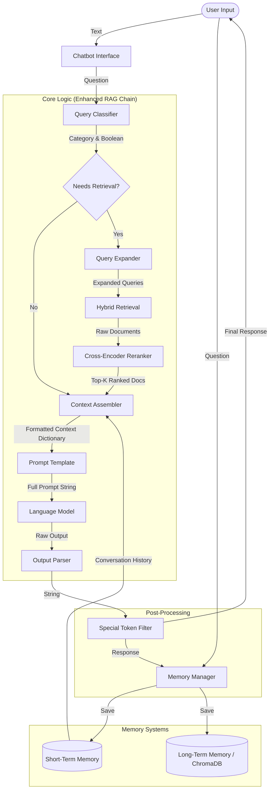

# Bot Architecture & Workflow

This document outlines the architecture and workflow of the chatbot, detailing each step, how text is injected, and the formatting used.

## Architecture Diagram



## Detailed Workflow Steps

### 1. Initialization
- **Components**: `Chatbot` initializes `LLMFactory`, `MemoryManager`, `ChainBuilder`, and `TimingManager`.
- **Chain Construction**: `ChainBuilder.build_enhanced_rag_chain()` assembles the processing pipeline.

### 2. Input Processing
- **User Input**: The user provides a text string (e.g., "What is the capital of France?").
- **Entry Point**: `Chatbot.chat()` or `Chatbot.stream_chat()`.

### 3. Query Classification
- **Component**: `QueryClassifier`
- **Input**: User question.
- **Action**: Classifies the intent (e.g., `factual`, `chat`, `summary`) and determines if retrieval is necessary.
- **Output**: `ClassificationResult` (category, needs_retrieval).

### 4. Query Expansion (If Retrieval Needed)
- **Component**: `QueryExpander`
- **Input**: User question.
- **Action**: Uses LLM to generate multiple search query variations to improve recall.
- **Output**: List of query strings.

### 5. Hybrid Retrieval
- **Component**: `MemoryManager` -> `ChromaDB`
- **Input**: Expanded queries, Category.
- **Action**: Performs semantic search (vector similarity) and optionally BM25 (keyword) search.
- **Output**: List of raw `Document` objects.

### 6. Reranking
- **Component**: `Reranker`
- **Input**: User question, Retrieved documents.
- **Action**: Uses a cross-encoder model to score and reorder documents based on relevance to the specific question.
- **Output**: Top-K ranked `Document` objects.

### 7. Context Assembly (Text Injection)
- **Component**: `ContextAssembler`
- **Input**: 
    - `short_term_history`: Recent conversation turns.
    - `long_term_docs`: Ranked documents from retrieval.
    - `question`: User question.
- **Action**: 
    - Calculates token budgets (STM vs LTM).
    - Truncates history and documents to fit `max_context_tokens`.
    - Formats the context string.
- **Output**: Dictionary `{"history": ..., "context": ..., "question": ...}`.

### 8. Prompt Injection
- **Component**: `ChatPromptTemplate`
- **Input**: Context dictionary from step 7.
- **Format**: The template (defined in config) injects variables:
    - `{system_prompt}`: Base instructions.
    - `{context}`: Long-term memory documents (joined by newlines).
    - `{history}`: Short-term conversation history (formatted as "Human: ... \n AI: ...").
    - `{question}`: The user's current input.
- **Result**: A single, complete prompt string sent to the LLM.

### 9. Generation & Parsing
- **Component**: `LLM` -> `StrOutputParser`
- **Action**: The LLM generates a response based on the full prompt. The parser extracts the text content.

### 10. Post-Processing & Storage
- **Filtering**: `filter_special_tokens` removes unwanted tokens (e.g., `<|eot_id|>`).
- **Memory Save**: `MemoryManager.save_interaction` stores the Q&A pair in:
    - **Short-Term**: In-memory list for immediate context.
    - **Long-Term**: ChromaDB for future retrieval.

## Data Formats

### Context Injection Format
The `context` variable injected into the prompt is formatted as a concatenation of document contents:
```text
Document 1 Content...

Document 2 Content...

...
```
*Truncated if exceeding the LTM token budget.*

### History Injection Format
The `history` variable is formatted as a dialogue script:
```text
Human: [User Message 1]
AI: [Bot Response 1]
Human: [User Message 2]
AI: [Bot Response 2]
```
*Truncated if exceeding the STM token budget.*
